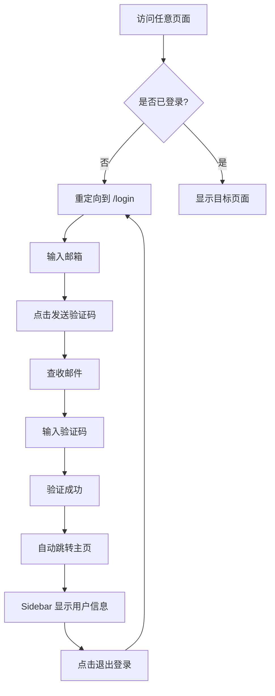

# ✅ 登录系统配置完成

## 🎉 已完成的功能

### 1. 邮箱验证码登录系统
- ✅ 基于 Supabase 的安全认证
- ✅ 无需密码，使用邮箱 OTP (一次性验证码)
- ✅ 60秒防重复发送保护
- ✅ 自动用户注册（首次登录）

### 2. 精美的登录界面
- ✅ 现代化科技感设计
- ✅ 渐变背景 + 动画效果
- ✅ 集成项目 Logo（盾牌 + 鹿角 + 心电图）
- ✅ 响应式布局，移动端友好
- ✅ 加载状态和错误提示
- ✅ 符合项目蓝色医疗主题

### 3. 完整的认证系统
- ✅ AuthContext 统一管理认证状态
- ✅ ProtectedRoute 保护所有页面
- ✅ Sidebar 显示用户信息和退出按钮
- ✅ 自动重定向（已登录跳转主页，未登录跳转登录页）

### 4. 配置文件更新
- ✅ .env 添加 Supabase 配置
- ✅ .env.example 提供配置模板
- ✅ 完整的 Supabase 配置指南

## 📁 新增文件

```
client/src/
├── lib/
│   └── supabase.ts                  # Supabase 客户端配置
├── contexts/
│   └── AuthContext.tsx              # 认证上下文管理
├── components/
│   └── ProtectedRoute.tsx           # 路由保护组件
└── pages/
    └── login.tsx                    # 登录页面

SUPABASE_SETUP_GUIDE.md             # Supabase 完整配置指南
LOGIN_SETUP_COMPLETE.md             # 本文档
```

## 🎨 设计特点

### 配色方案
- **主色**: 医疗蓝 `#3b82f6` (hsl(207, 90%, 54%))
- **深蓝绿**: `#1e3a47` (Logo 主色)
- **辅助色**: 青色渐变，打造科技感
- **背景**: 渐变 from-slate-50 via-blue-50 to-slate-100

### 视觉元素
1. **动态背景**
   - 3 个渐变色圆形动画
   - 网格背景增强科技感
   - 模糊效果营造纵深感

2. **Logo 设计**
   - SVG 手绘盾牌 + 鹿角 + 心电图
   - 渐变容器背景
   - 外圈光晕动画效果
   - 阴影增强立体感

3. **表单设计**
   - 大尺寸输入框 (h-12) 提升易用性
   - 渐变按钮增强视觉吸引力
   - 倒计时防止频繁发送
   - 友好的错误和成功提示

## 🔐 安全特性

1. **OTP 验证码**
   - 6 位数字验证码
   - 5 分钟过期时间
   - 单次使用，用后失效

2. **Session 管理**
   - 自动检测登录状态
   - 监听认证状态变化
   - Token 自动刷新

3. **路由保护**
   - 所有页面需要登录
   - 未登录自动重定向到登录页
   - 已登录访问登录页自动跳转主页

## 🚀 使用流程

### 1. 配置 Supabase（必需）

参考 `SUPABASE_SETUP_GUIDE.md` 完成以下步骤：

1. 在 https://supabase.com 创建项目
2. 获取 Project URL 和 anon key
3. 更新 `.env` 文件：

```bash
VITE_SUPABASE_URL=https://你的项目id.supabase.co
VITE_SUPABASE_ANON_KEY=eyJhbGciOiJIUzI1NiIsInR5cCI6IkpXVCJ9...
```

### 2. 启动应用

```bash
npm install
npm run dev
```

### 3. 访问登录页面

打开 `http://localhost:3001`，会自动重定向到 `/login`

### 4. 登录测试

1. 输入邮箱地址
2. 点击"发送验证码"
3. 查看邮箱获取 6 位验证码
4. 输入验证码点击"验证并登录"
5. 成功后自动跳转到主页

## 📱 登录页面预览

### 桌面版
```
┌─────────────────────────────────────────────┐
│                                             │
│        ┌──────────────────────┐            │
│        │   [Logo with Glow]   │            │
│        │                      │            │
│        │   AnesGuardian       │            │
│        │   麻醉术前评估智能系统│            │
│        │                      │            │
│        │   📧 邮箱地址         │            │
│        │   [_______________]  │            │
│        │                      │            │
│        │   [发送验证码]        │            │
│        │                      │            │
│        │   使用邮箱验证码登录  │            │
│        │   安全·便捷·无需密码  │            │
│        └──────────────────────┘            │
│                                             │
└─────────────────────────────────────────────┘
```

### 关键 UI 元素
- **Logo**: 居中显示，带光晕动画
- **标题**: AnesGuardian + 中文副标题
- **输入框**: 大尺寸，清晰易用
- **按钮**: 渐变蓝色，悬停效果
- **装饰**: 动态背景，医疗图标

## 🔄 用户体验流程



## 🎯 Sidebar 用户信息显示

登录后，Sidebar 底部会显示：

```
┌─────────────────────┐
│  [👤] username      │
│       user@email    │
│                     │
│  [🚪 退出登录]      │
└─────────────────────┘
```

## 🐛 故障排查

### 问题：收不到验证码邮件
- 检查垃圾邮件文件夹
- 确认 Supabase Email OTP 已启用
- 等待 1-2 分钟，邮件可能延迟

### 问题：验证码错误
- 确认输入的是最新收到的验证码
- 验证码有效期 5 分钟
- 尝试重新发送

### 问题：登录后立即退出
- 检查 Supabase 配置是否正确
- 查看浏览器控制台错误信息
- 确认环境变量以 `VITE_` 开头

## 📝 自定义建议

### 修改 Logo
编辑 `client/src/pages/login.tsx` 的 SVG 部分

### 修改配色
在 `login.tsx` 中搜索颜色类：
- `from-blue-500`: 渐变起始色
- `bg-[#1e3a47]`: Logo 容器背景
- `text-blue-600`: 文字强调色

### 添加其他登录方式
参考 Supabase 文档添加：
- Google OAuth
- GitHub OAuth
- 手机号验证码

## ✨ 下一步建议

1. **用户资料页面**
   - 显示和编辑用户信息
   - 头像上传
   - 偏好设置

2. **权限系统**
   - 定义不同用户角色（医生、护士、管理员）
   - 基于角色的访问控制
   - 数据访问权限

3. **安全增强**
   - 配置 Supabase RLS (Row Level Security)
   - 添加 2FA 两步验证
   - 登录日志和异常检测

4. **生产环境部署**
   - 创建独立的生产环境 Supabase 项目
   - 配置自定义域名
   - 设置邮件发送域名（避免被标记为垃圾邮件）

## 📞 支持

- 查看 `SUPABASE_SETUP_GUIDE.md` 获取详细配置说明
- 访问 Supabase 官方文档：https://supabase.com/docs
- 项目源码：`client/src/pages/login.tsx`

---

**配置完成，开始使用吧！** 🎊
