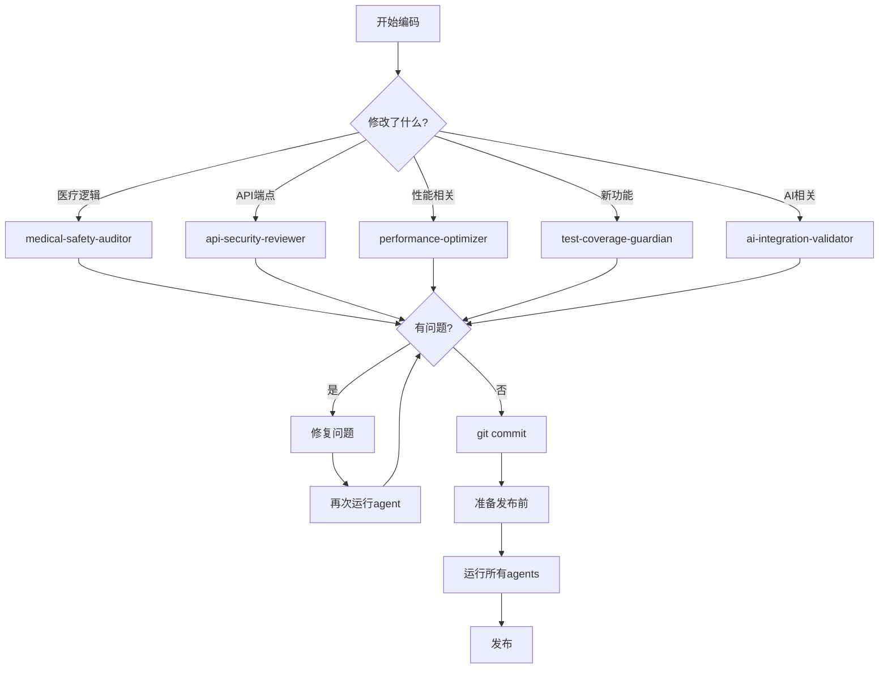

# AnesGuardian 专用Agents使用指南

**文档版本：** 1.0
**最后更新：** 2025-11-05

---

## 📖 什么是Agents

Agents是Claude Code的专用助手，每个agent都有特定的专业知识和审查职责。对于AnesGuardian医疗AI项目，我们创建了5个专用agents来帮助你提高代码质量、安全性和性能。

---

## 🤖 5个专用Agents概览

| Agent | 职责 | 使用时机 | 优先级 |
|-------|------|----------|--------|
| medical-safety-auditor | 医疗逻辑和安全性审计 | 修改风险评估、药物逻辑后 | 🔴 极高 |
| api-security-reviewer | API安全性审查 | 添加/修改API端点后 | 🔴 极高 |
| performance-optimizer | 性能瓶颈识别和优化 | 感觉卡顿、准备发布前 | 🟠 高 |
| test-coverage-guardian | 测试覆盖率检查 | 添加新功能、重构代码后 | 🟠 高 |
| ai-integration-validator | AI服务质量检查 | 修改prompt、AI参数后 | 🟡 中 |

---

## 1️⃣ medical-safety-auditor

### 🎯 主要职责

**医疗逻辑验证：**
- ✅ 验证风险评分算法（Mallampati, Goldman, Caprini, Apfel）
- ✅ 检查药物相互作用判断的医学依据
- ✅ 审查临床指南引用的准确性
- ✅ 确保医疗决策流程合理

**医疗数据安全：**
- ✅ 检查患者隐私信息加密存储
- ✅ 验证医疗记录访问控制
- ✅ 确保敏感信息脱敏处理
- ✅ 审查数据完整性和审计日志

### 📂 重点审查文件

- `server/services/simple-agents.ts` - 风险评估逻辑
- `server/services/drug-enhancement.ts` - 药物分析
- `server/services/medical-report-analyzer.ts` - 医疗记录分析
- `shared/schema.ts` - 数据安全

### 🔍 使用示例

**场景1: 修改风险评估逻辑后**

```typescript
// 你刚修改了风险因素生成逻辑
// server/services/simple-agents.ts

private generateRiskFactorsFromPatientData(patient) {
  const riskFactors = [];

  // 新增逻辑: 基于年龄评估气道风险
  if (patient.age > 65) {
    riskFactors.push({
      type: 'airway',
      level: 'medium',
      description: '老年患者气道管理风险增加',
      // ...
    });
  }

  // ...
}
```

**使用agent审查：**
1. 运行Claude Code
2. 要求运行 `medical-safety-auditor` agent
3. Agent会检查：
   - 年龄阈值65岁是否有医学依据
   - 风险等级'medium'是否合适
   - 描述是否准确
   - 是否需要添加更多建议

**Agent可能的反馈：**
```markdown
### 🟡 中风险：年龄阈值需要医学依据

**位置：** simple-agents.ts:125

**医学依据：**
根据麻醉学文献，老年患者（通常定义为≥65岁）确实存在气道管理风险增加。
但建议考虑：
1. 65岁以上定为medium，75岁以上定为high
2. 结合BMI和其他因素综合评估
3. 添加具体的监测建议

**建议代码：**
```typescript
if (patient.age >= 75 || (patient.age >= 65 && bmi > 30)) {
  riskFactors.push({
    type: 'airway',
    level: patient.age >= 75 ? 'high' : 'medium',
    description: `${patient.age}岁老年患者，气道管理需特别关注`,
    recommendations: [
      '术前评估困难气道可能性',
      '准备多种气道管理设备',
      '考虑清醒插管'
    ]
  });
}
```
```

---

**场景2: 添加新的药物相互作用规则**

```typescript
// server/services/drug-enhancement.ts

// 新增: 检测SSRI与曲马多的相互作用
const checkSSRITramadol = (drugs) => {
  const ssriDrugs = ['氟西汀', '帕罗西汀', '舍曲林'];
  const hasSSRI = drugs.some(d => ssriDrugs.includes(d));
  const hasTramadol = drugs.includes('曲马多');

  if (hasSSRI && hasTramadol) {
    return {
      severity: 'major',
      description: 'SSRI与曲马多联用可能导致血清素综合征',
      // ...
    };
  }
};
```

**Agent审查要点：**
- ✅ 药物分类是否准确（SSRI列表是否完整）
- ✅ 相互作用的医学描述是否正确
- ✅ 严重程度分级（major）是否恰当
- ✅ 建议是否包含监测要点

---

### ⏰ 使用时机

**必须使用：**
- ❗ 修改风险评估相关代码
- ❗ 添加或修改药物相互作用规则
- ❗ 更改医疗评分计算
- ❗ 修改AI医疗prompt
- ❗ 变更患者数据处理逻辑

**建议使用：**
- 📅 每周代码审查时
- 📅 准备发布前
- 📅 收到医疗专业人士反馈后

---

## 2️⃣ api-security-reviewer

### 🎯 主要职责

**认证和授权：**
- ✅ 验证端点认证要求
- ✅ 检查权限控制
- ✅ 审查Session安全配置

**输入验证：**
- ✅ Zod schema完整性
- ✅ 输入清理和转义
- ✅ 文件上传安全性
- ✅ SQL注入防护

**速率限制：**
- ✅ 全局API限制
- ✅ AI端点特殊限制
- ✅ 限制阈值合理性

**数据传输：**
- ✅ HTTPS强制
- ✅ CORS配置
- ✅ 安全Headers

### 📂 重点审查文件

- `server/routes.ts` - 所有API端点
- `server/middleware/` - 安全中间件
- `shared/schema.ts` - 数据验证

### 🔍 使用示例

**场景: 添加新的API端点**

```typescript
// server/routes.ts

// 新增: 批量删除患者
app.delete("/api/patients/batch", async (req, res) => {
  const { patientIds } = req.body;

  for (const id of patientIds) {
    await storage.deletePatient(id);
  }

  res.json({ message: "Patients deleted" });
});
```

**Agent会发现的问题：**
```markdown
### 🔴 严重：批量删除端点存在多个安全问题

**OWASP分类：** A01: Broken Access Control

**问题清单：**
1. ❌ 无认证检查 - 任何人都可以删除患者
2. ❌ 无速率限制 - 可能被滥用进行DoS攻击
3. ❌ 无输入验证 - patientIds可能是任意值
4. ❌ 无权限检查 - 用户可以删除不属于自己的患者
5. ❌ 无数量限制 - 可一次删除所有患者

**风险等级：** 🔴 严重

**修复方案：**
```typescript
// 1. 添加认证和速率限制
app.delete("/api/patients/batch",
  requireAuth,  // 添加认证
  apiLimiter,   // 添加速率限制
  async (req, res) => {
    // 2. 输入验证
    const BatchDeleteSchema = z.object({
      patientIds: z.array(z.number()).min(1).max(10) // 最多10个
    });

    const result = BatchDeleteSchema.safeParse(req.body);
    if (!result.success) {
      throw new ValidationError('Invalid patient IDs');
    }

    const { patientIds } = result.data;

    // 3. 权限检查
    for (const id of patientIds) {
      if (!await canDeletePatient(req.user, id)) {
        throw new UnauthorizedError('Cannot delete this patient');
      }
    }

    // 4. 执行删除
    const deleted = [];
    for (const id of patientIds) {
      await storage.deletePatient(id);
      deleted.push(id);
    }

    // 5. 审计日志
    logger.info('Batch delete patients', {
      userId: req.user.id,
      patientIds: deleted,
      count: deleted.length
    });

    res.json({
      message: `Successfully deleted ${deleted.length} patients`,
      deletedIds: deleted
    });
  }
);
```
```

---

### ⏰ 使用时机

**必须使用：**
- ❗ 添加新的API端点
- ❗ 修改认证/授权逻辑
- ❗ 更改CORS配置
- ❗ 添加文件上传功能

**建议使用：**
- 📅 每次git commit前
- 📅 代码审查时
- 📅 定期安全审计

---

## 3️⃣ performance-optimizer

### 🎯 主要职责

**前端性能：**
- ✅ React组件渲染优化
- ✅ Bundle大小分析
- ✅ 图片和资源优化
- ✅ 网络请求优化

**后端性能：**
- ✅ 数据库查询优化
- ✅ API响应时间
- ✅ 缓存策略
- ✅ 内存使用

### 📂 重点审查文件

- `client/src/pages/*.tsx` - 页面组件
- `client/src/components/*.tsx` - 复用组件
- `server/routes.ts` - API端点
- `server/storage.ts` - 数据访问

### 🔍 使用示例

**场景: 患者列表页面卡顿**

```typescript
// client/src/pages/patients.tsx

function Patients() {
  const [searchTerm, setSearchTerm] = useState('');
  const { data: patients } = useQuery('/api/patients');

  // 每次输入都过滤，导致卡顿
  const filteredPatients = patients?.filter(p =>
    p.name.includes(searchTerm)
  );

  return (
    <div>
      <input onChange={(e) => setSearchTerm(e.target.value)} />
      {filteredPatients?.map(patient => (
        <PatientCard key={patient.id} patient={patient} />
      ))}
    </div>
  );
}
```

**Agent诊断：**
```markdown
### 🟠 高：患者列表重复渲染导致卡顿

**性能影响：** 🟠 高
**预计提升：** 80%

**问题：**
1. 每次输入触发所有PatientCard重新渲染
2. 过滤逻辑没有记忆化
3. PatientCard组件没有优化

**优化方案：**
见下方代码（包含3个步骤的完整优化）
```

---

### ⏰ 使用时机

**必须使用：**
- ❗ 用户反馈性能问题时
- ❗ 添加复杂页面或组件后
- ❗ 准备发布前性能测试

**建议使用：**
- 📅 每月定期性能审查
- 📅 代码重构后验证
- 📅 数据量增长后

---

## 4️⃣ test-coverage-guardian

### 🎯 主要职责

**测试覆盖分析：**
- ✅ 识别未测试的关键代码
- ✅ 生成测试用例建议
- ✅ 审查测试完整性
- ✅ 检查边界条件测试

### 📂 重点审查文件

- `shared/schema.ts` - Schema测试
- `server/services/simple-agents.ts` - 业务逻辑测试
- `server/routes.ts` - API测试

### 🔍 使用示例

**场景: 添加新功能后**

```typescript
// 新增功能: 计算Apfel评分（术后恶心呕吐风险）
function calculateApfelScore(patient) {
  let score = 0;

  if (patient.gender === '女') score += 1;
  if (patient.hasMotionSickness) score += 1;
  if (patient.hasHistoryOfPONV) score += 1;
  if (patient.isNonSmoker) score += 1;

  return {
    score,
    risk: score >= 3 ? 'high' : score >= 2 ? 'medium' : 'low'
  };
}
```

**Agent建议：**
```markdown
### 🟠 中：Apfel评分计算缺少测试

**位置：** server/services/risk-calculator.ts:45

**建议测试用例（8个）：**

**边界条件（4个）：**
1. ✅ 所有因素为真（score = 4, risk = high）
2. ✅ 所有因素为假（score = 0, risk = low）
3. ✅ 恰好2个因素（score = 2, risk = medium）
4. ✅ 恰好3个因素（score = 3, risk = high）

**典型场景（4个）：**
5. ✅ 女性非吸烟者（score = 2）
6. ✅ 男性吸烟者（score = 0）
7. ✅ 有晕动病史的女性（score = 2-3）
8. ✅ 缺少某些字段的患者

**测试代码示例：**
```typescript
describe('calculateApfelScore', () => {
  it('应该正确计算女性非吸烟者的分数', () => {
    const patient = {
      gender: '女',
      hasMotionSickness: false,
      hasHistoryOfPONV: false,
      isNonSmoker: true
    };

    const result = calculateApfelScore(patient);

    expect(result.score).toBe(2);
    expect(result.risk).toBe('medium');
  });

  // ... 更多测试
});
```
```

---

### ⏰ 使用时机

**必须使用：**
- ❗ 添加新功能后
- ❗ 重构现有代码后
- ❗ 准备发布前

**建议使用：**
- 📅 每周检查测试覆盖率
- 📅 Code review时

---

## 5️⃣ ai-integration-validator

### 🎯 主要职责

**Prompt质量：**
- ✅ 角色定义清晰
- ✅ 输出格式明确
- ✅ 中文医疗优化
- ✅ Few-shot示例质量

**参数配置：**
- ✅ 模型选择合适
- ✅ Temperature配置
- ✅ Token优化

**错误处理：**
- ✅ 重试机制
- ✅ 截断检测
- ✅ Fallback策略

**成本优化：**
- ✅ Prompt简洁
- ✅ 批处理机会
- ✅ 缓存策略

### 📂 重点审查文件

- `server/services/gemini.ts` - Gemini API
- `server/services/chat.ts` - AI问答
- `server/services/medical-report-analyzer.ts` - 报告分析

### 🔍 使用示例

**场景: 优化AI对话服务**

```typescript
// server/services/chat.ts

const result = await model.generateContent({
  contents: [{ role: 'user', parts: [{ text: userMessage }] }],
  generationConfig: {
    temperature: 0.7,
    maxOutputTokens: 8192,  // 固定使用最大值
  }
});
```

**Agent优化建议：**
```markdown
### 🟠 高：Token配置浪费导致成本增加300%

**成本影响：**
- 当前：平均8000 tokens/次
- 优化后：平均2500 tokens/次
- **节省：68%成本**

**优化方案：**
根据问题复杂度动态调整tokens
（见完整代码示例）
```

---

### ⏰ 使用时机

**必须使用：**
- ❗ 修改AI prompt后
- ❗ 更改模型或参数后
- ❗ AI成本异常增加时

**建议使用：**
- 📅 每月审查AI成本
- 📅 用户反馈AI质量问题时

---

## 📋 Agents使用工作流

### 推荐工作流程



### 每次Commit前检查清单

```bash
# 1. 确定修改的文件类型
git status

# 2. 根据修改运行相应的agents
# 医疗逻辑变更
→ 运行 medical-safety-auditor

# API变更
→ 运行 api-security-reviewer

# 3. 修复发现的问题

# 4. 提交代码
git add .
git commit -m "feat: xxx"

# 5. 准备发布前运行所有agents
→ 运行全部5个agents
```

---

## 🎯 Agents使用最佳实践

### 1. 及时使用

**❌ 不好的做法：**
```
写完所有代码 →
等到发布前 →
一次性运行所有agents →
发现100个问题 →
难以修复
```

**✅ 好的做法：**
```
修改风险评估代码 →
立即运行medical-safety-auditor →
发现2个问题 →
立即修复 →
继续开发
```

### 2. 理解Agent反馈

**Agent的反馈包含：**
- 问题描述：清晰说明什么不对
- 风险等级：严重程度
- 医学/技术依据：为什么这是问题
- 修复建议：具体怎么改
- 代码示例：可直接使用的代码

**不要只看代码，要理解原因！**

### 3. 定期审查

**建议审查频率：**
- 🔴 medical-safety-auditor：每周1次
- 🔴 api-security-reviewer：每次API变更
- 🟠 performance-optimizer：每月1次
- 🟠 test-coverage-guardian：每周1次
- 🟡 ai-integration-validator：AI修改时

### 4. 记录和学习

**建立知识库：**
```markdown
# 常见问题和解决方案

## 问题1：年龄阈值的医学依据
**Agent：** medical-safety-auditor
**问题：** 老年患者年龄阈值设置
**解决：** 65岁为中风险，75岁为高风险
**依据：** ASA指南

## 问题2：速率限制配置
**Agent：** api-security-reviewer
**问题：** AI端点无速率限制
**解决：** 10次/分钟
**原因：** 防止成本飙升和DoS
```

---

## 🚀 快速参考

### Agents选择决策树

```
修改代码后...

└─ 涉及患者数据或医疗逻辑?
   ├─ 是 → medical-safety-auditor
   └─ 否 → 继续

└─ 涉及API端点或安全?
   ├─ 是 → api-security-reviewer
   └─ 否 → 继续

└─ 感觉性能有问题?
   ├─ 是 → performance-optimizer
   └─ 否 → 继续

└─ 添加了新功能?
   ├─ 是 → test-coverage-guardian
   └─ 否 → 继续

└─ 修改了AI相关代码?
   ├─ 是 → ai-integration-validator
   └─ 否 → 完成
```

### 常用Agent命令

```bash
# 查看所有可用agents
/agents

# 使用特定agent（在Claude Code中）
@medical-safety-auditor 请审查我刚修改的风险评估代码

@api-security-reviewer 检查这个新API端点的安全性

@performance-optimizer 分析为什么患者列表加载很慢

@test-coverage-guardian 我需要为这个函数写哪些测试用例

@ai-integration-validator 帮我优化这个AI prompt
```

---

## ❓ 常见问题

### Q: 是否每次修改都要运行agents?

**A:** 不需要。根据修改类型选择相应的agent：
- 小改动（如修复typo）：不需要
- 逻辑变更：必须运行相关agent
- 准备发布：运行所有agents

### Q: Agent发现的问题必须全部修复吗?

**A:** 根据优先级：
- 🔴 严重和高危：必须立即修复
- 🟠 中危：短期内修复
- 🟡 低危：记录到TODO，择机修复

### Q: 如何知道agent的建议是否正确?

**A:**
1. 查看agent提供的医学/技术依据
2. 参考相关文档和标准
3. 如有疑问，咨询专业人士
4. Agent的建议是辅助，最终决策由你做

### Q: Agents会自动运行吗?

**A:**
目前需要手动调用。建议：
- 在git pre-commit hook中添加提示
- 建立checklist养成习惯
- 定期审查时集中运行

---

## 📚 相关文档

- `docs/优化实施计划-8周路线图.md` - 详细优化计划
- `docs/优化进度追踪.md` - 进度跟踪表
- `docs/生产环境上线检查清单.md` - 上线前验证
- `.claude/agents/*.md` - 各个agent的详细配置

---

**记住：Agents是你的助手，不是替代品。最终的代码质量和医疗安全责任仍然在你！** 🎯
